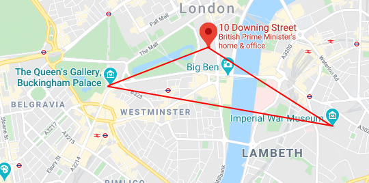
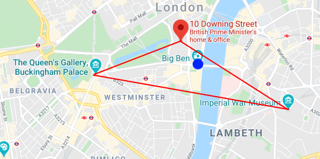
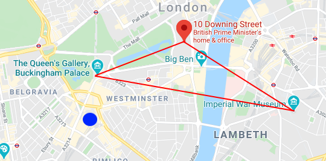
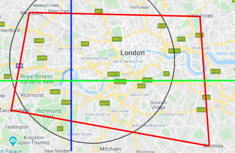

<div align="center">
  

  <p>Location manager is the easiest solution to maintain service areas and check whether physical locations of various types are within certain defined areas.</p>

  <a href="https://npmjs.com/package/location-manager">
    
  </a>

  <a href="./LICENSE">
    
  </a>
</div>

<br>

> Example: Create circumference of 50km around 10 Downing Street and check if Buckingham Place falls within the circumference.

```js
await LocationManager.addCircumference({
  centre: new LM.Address("10 Downing Street, London"),
  range: 50
});

// evaluates to true
const isInRange = await LocationManager.checkInRange(
  new LM.Address("Buckingham Palace, London")
);
```

## Inspiration

We at Shopolivery needed a way to manage the service area of the Shopolivery service; the Shopolivery service isn't available in all locations, so we needed a convenient, robust library to verify whether user locations of all types (such as postcodes and addresses) were within irregular, defined-by-us service areas, so we created location manager. Location manager helps check whether physical locations are within defined areas such as circumferences and bounds.

## Basic Usage

You can install location-manager from NPM:

```
$ npm i location-manager
```

You can then initialise the library in Node:

```js
const LM = require("location-manager");
const LocationManager = new LM();
```

You can then add a valid area to the manager using functions on the LocationManager:

```js
await LocationManager.addBounds({
  bounds: [
    new LM.Address("10 Downing Street, London"),
    new LM.Address("Imperial War Museum, London")
    new LM.Address("Buckingham Palace, London"),
  ]
});
```

This will in effect create a triangle with the three locations as the points, with any address inside the triangle being a valid location for `LocationManager.checkInRange()`.



You can then check for a valid address within the bounds like:

```js
const bigBenLocation = new LM.Address("Big Ben, Westminster");
await LocationManager.checkInRange(bigBenLocation); // evaluates to true
```

Which evaluates to `true` because Big Ben is within the area defined by the bounds above.



An address such as Victoria Station will evaluate to `false` because it is outside the bounds above.

```js
const victoriaStationLocation = new LM.Address("Victoria Station, London");
await LocationManager.checkInRange(victoriaStationLocation); // evaluates to false
```



You can also combine multiple area types, as seen below, to create a powerful and refined chosen area.

```js
// presuming location manager starting with no areas set

await LocationManager.addBounds({
  bounds: [
    new LM.Address("Stratford, London"),
    new LM.Address("Bromley, London"),
    new LM.Address("Twickenham, London"),
    new LM.Address("Wembley, London")
  ]
});

await LocationManager.addCircumference({
  centre: new LM.Address("Kensington, London"),
  radius: 10
});

await LocationManager.addLine({
  type: "vertical",
  side: "right",
  alignment: new LM.Address("White City, London")
});

await LocationManager.addLine({
  type: "horizontal",
  side: "above",
  alignment: new LM.Address("Fullham, London")
});
```

This effectively creates the area seen below. The valid area is above the green line, to the right of the blue line, and inside the black circle and inside the red polygon.



This causes the results below.

```js
await LocationManager.checkInRange(new LM.Address("Kensington, London")); // true
await LocationManager.checkInRange(new LM.Address("Westminster, London")); // true
await LocationManager.checkInRange(new LM.Address("Buckingham Palace, London")); // true
await LocationManager.checkInRange(new LM.Address("Balham, London")); // false
await LocationManager.checkInRange(new LM.Address("Holloway, London")); // false
```

## Example Usages

You can create three different types of location references to locations, which can be used with the location manager: `address` (can lookup any address on the globe), `UKPostcode` (can lookup any postcode in the UK) and `coordinates` (can reference any co-ordinates on the globe).

```js
// de-structured address
new LM.Address("Buckingham Palace, London");
// structured address (faster)
new LM.Address({
  city: "London",
  street: "Buckingham Palace Road"
});

// faster than looking up postcode through the address object
new LM.UKPostcode("SW1A 1AA");

// fastest
new LM.Coordinate(51.501247, -0.142437);
```

You can create three different types of area references: `circumference`, `line` and `bounds`. You can add them to the location manager with their relevant `add` method.

```js
// you can add an unlimited amount of bounds
await LocationManager.addBounds({
  bounds: [
    new LM.Address("Stratford, London"),
    new LM.Address("Bromley, London"),
    new LM.Address("Twickenham, London"),
    new LM.Address("Wembley, London")
  ]
});

// if type is "horizontal", side can be "above" or "below"
// if type is "vertical", side can be "left" or "right"
// alignment specifies where the line crosses
// valid area is where the side points, e.g. if side is "above" valid area is above the line
await LocationManager.addLine({
  type: "horizontal",
  side: "above",
  alignment: new LM.Address("Fullham, London")
});

// centre is the centre of the circle
// radius is the radius of the valid area in kilometres
await LocationManager.addCircumference({
  centre: new LM.Address("Kensington, London"),
  radius: 10
});
```

You can instead create and return an area reference (but not add it to the location manager). Each area reference has a relevant method, e.g.

```js
const circumference = await LocationManager.createCircumference({
  centre: new LM.Address("Buckingham Palace, London"),
  radius: 5
});
```

Test if location reference is valid in current location manager.

```js
await LocationManager.checkInRange(locationObject);
```

Test whether specified locations are within specified area definitions.

```js
await LocationManager.checkInModelRange(circumferenceArea, addressReference);
await LocationManager.checkInModelRange(
  [circumferenceArea, boundsArea],
  postcodeReference
);
```

## Credit

Made with 💖 by . We at Shopolivery love open source software - we recognise the internet (and by extent Shopolivery) is only possible with the hard work of open source maintainers - so we are committed to contribute by maintaining and creating open source software under permissive licenses.

Lead Maintainer: [Tom](https://github.com/TomPrograms)

## License

[MIT](./LICENSE)
